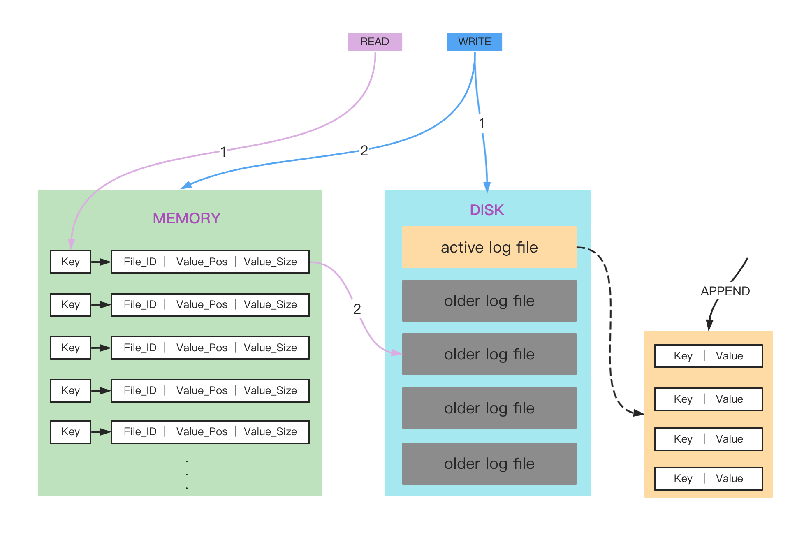

# What is LAZYDB

lazydb is a lightweight, fast and reliable key/value storage engine based on Bitcask storage model.

The design of Bitcask was inspired, in part, by log-structured filesystems and log file merging.

# Status
- [x] Data Structures API (String Hash Set List ZSet)
- [x] Garbage Collection
- [x] Supports mmap File Controller to accelerate IO
- [x] Supports configurable log merging
- [ ] Transaction (Ongoing)


# Architecture

LazyDB can be highly generalized into two layers; in memory, we store the location information of the data corresponding to each key through indexes, and on disk, we store the data in a log structure

# Key Features
## Strength
This project intends to build a K-V store engine that achieves:
- Low latency per item read or written
    > This is due to the write-once, append-only nature of Bitcask database files.
- High throughput, especially when writing an incoming stream of random items
    > Write operations to LazyDB generally saturate I/O and disk bandwidth, which is a good thing from a performance perspective. This saturation occurs for two reasons: because (1) data that is written to LazyDB doesn't need to be ordered on disk, and (2) the log-structured design of Bitcask allows for minimal disk head movement during writes.
- Crash recovery: fast and with guarantee of not losing any data
    > Due to write-once, append-only nature of Bitcask, the only items that may be lost are partially written records at the tail of the last file that was opened for writes. The consistency of records can be verified by checking CRC in each record.
- Support for rich data structures for different scenarios
- Single seek to retrieve any value
    > Avoiding read amplification problems through in-memory index design. The in-memory index saves the latest location of the data, and reading any key requires no more than one disk seek.
- Ability to handle datasets larger than RAM
    > Access to data in LazyDB involves direct lookup from an in-memory index data structure. This makes finding data very efficient, even when datasets are very large.
- Transaction
    > LazyDB supports batch operations which are atomic, consistent, and durable. The new writes in batch are cached in memory before committing. If the batch is committed successfully, all the writes in the batch will be persisted to disk. If the batch fails, all the writes in the batch will be discarded.
 
## Weakness
- Memory size can be a storage bottleneck

# Usage

```GO

```

# Benchmark
The benchmark results were gathered using a test environment consisting of a Darwin operating system running on a 2.2 GHz Quad-Core Intel Core i7 CPU, an Intel x86 architecture with 8 concurrent threads.
Here are the steps to perform the benchmark tests:
1. Initialize all the databases with the default setting.
2. Insert 500K (limited by the hardware) records to each database.
3. Perform the following tests in N times (decided by Go benchmark tool) on the same data structure (only STRING):
   1. Single thread reading.
   2. Single thread writing.
   3. Concurrent reading.
   4. Concurrent writing.
   5. Random concurrent reading or writing.

## Read & Write - Built-in File IO vs. MMAP


By applying MMAP as IOController, approximately a 600% increase in file read speeds and a 20% increase in write speeds, also reduced 3 times memory allocation.
## Single Thread Read & Write - (Compared with Other KV Databases)

LazyDB has advantages on
Read & Write speed and Read Memory & Objects allocated. 

## Concurrent Read & Write
